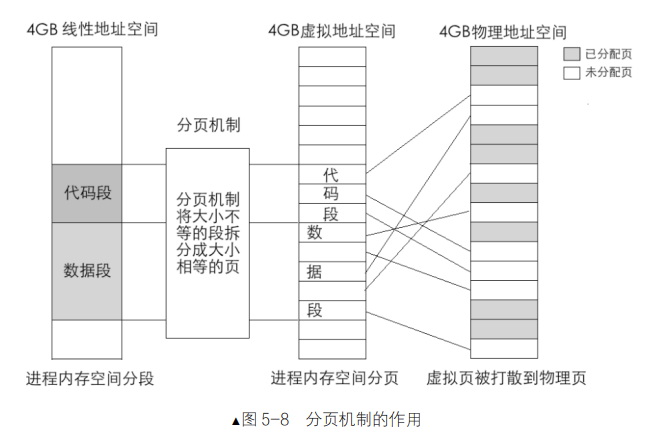
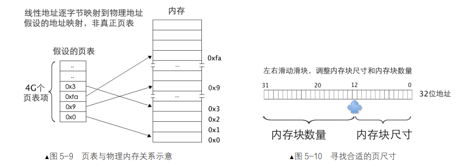
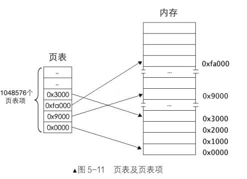
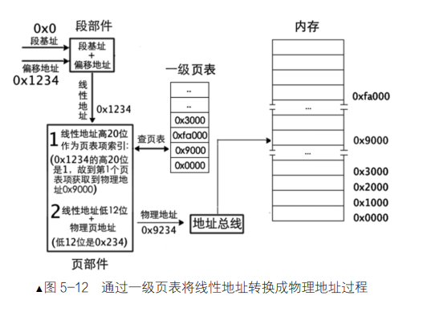
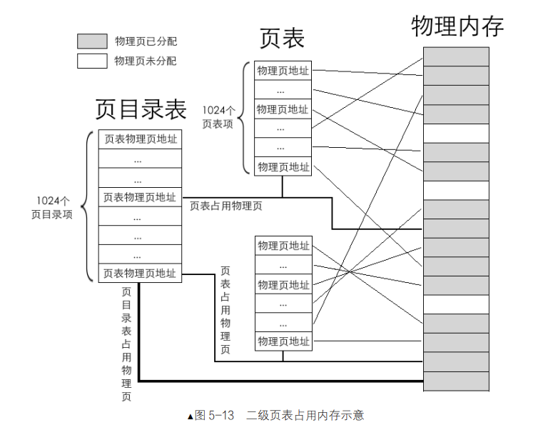
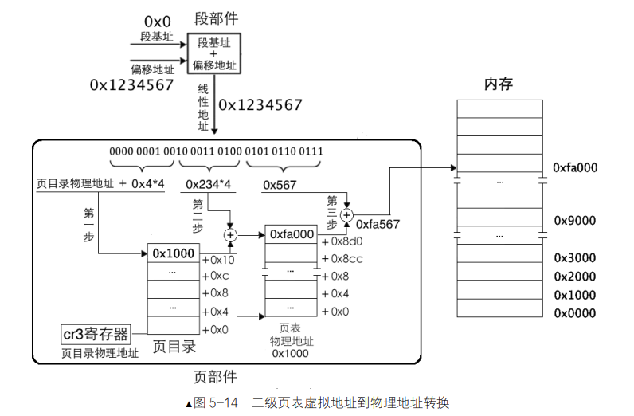

# X86TinyOS

## 保护模式
### 段描述符

| 字段 | 说明 |
|------|------|
| TYPE | 表示内存段或门的子类型 |
| S | 0：系统段，1：非系统段 |
| DPL | 描述符特权级，表示0，1，2，3级特权，数字越小，特权级越大 |
| P | Present, CPU检查段是否存在内存中 |
| L | 1: 64位代码段，0: 32位代码段 |
| D/B | |
| G | 0: 段界限粒度为1字节，1: 段界限粒度为4kB字节， 实际段界限=(描述符中段界限+1)*段界限粒度-1 |

### 内存分页
  

分页机制的作用：
    1. 将线性地址转换成物理地址
    2. 用大小相等的页替代大小不等的段

为了节省页表空间，如何计算页尺寸：
32 位地址表示 4GB 空间，可以将 32 位地址分成高低两部分，低地址部分是内存块大小，高地址部分是
内存块数量，它们是这样一种关系：内存块数*内存块大小=4GB。

页部件：cpu集成用来将线性地址转换成对应物理地址的模块
页部件的工作：用线性地址的高 20 位在页表中索引页表项，用线性地址的低 12 位与页表项
中的物理地址相加，所求的和便是最终线性地址对应的物理地址

### 二级页表

高10位：页目录项中的页表索引
中10位：页表物理页的索引
低12位：页内偏移，用于物理页内寻址